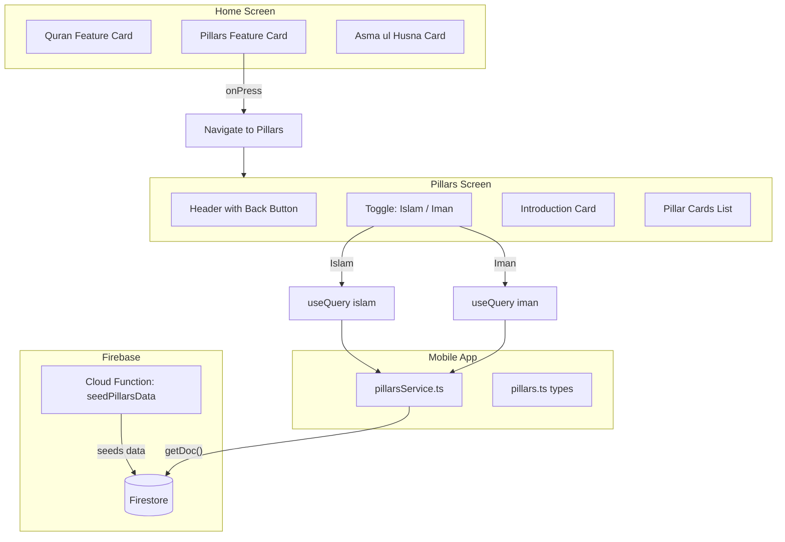

# Pillars of Islam Feature

## Overview

This feature adds a new "Pillars of Islam" section to the app with:

- A feature card on the home screen (below the Quran card)
- A dedicated screen with a toggle to switch between **5 Pillars of Islam** (practices) and **6 Pillars of Iman** (beliefs)
- Beautiful, informative cards for each pillar with icons, Arabic text, meanings, and significance
- **Data stored in Firebase Firestore** for easy management and updates

---

## Firebase Database Structure

### Collection: `pillars`

Two documents in this collection:

**Document: `islam`**

```json
{
  "type": "islam",
  "title": "5 Pillars of Islam",
  "description": "The five pillars are the core practices...",
  "pillars": [
    {
      "number": 1,
      "name": "Shahada",
      "arabicName": "الشهادة",
      "meaning": "Declaration of Faith",
      "icon": "heart-outline",
      "description": "The testimony that there is no god but Allah...",
      "significance": "It is the first step to becoming a Muslim..."
    }
  ]
}
```

**Document: `iman`**

```json
{
  "type": "iman",
  "title": "6 Pillars of Iman",
  "description": "The six pillars of faith are the core beliefs...",
  "pillars": [
    {
      "number": 1,
      "name": "Belief in Allah",
      "arabicName": "الإيمان بالله",
      "meaning": "Oneness of God (Tawhid)",
      "icon": "infinite-outline",
      "description": "Recognizing that there is only one God...",
      "significance": "The foundation of all Islamic belief..."
    }
  ]
}
```

---

## Content Summary

### 5 Pillars of Islam (Actions/Practices)

1. **Shahada** (الشهادة) - Declaration of Faith: The testimony that there is no god but Allah, and Muhammad is His Messenger. It is the foundation of Muslim faith and the first step to becoming a Muslim.

2. **Salah** (الصلاة) - Five Daily Prayers: The five obligatory prayers performed at dawn (Fajr), midday (Dhuhr), afternoon (Asr), sunset (Maghrib), and night (Isha). It is the believer's direct connection with Allah.

3. **Zakat** (الزكاة) - Almsgiving: The obligatory giving of 2.5% of one's savings annually to those in need. It purifies wealth and promotes social justice.

4. **Sawm** (الصوم) - Fasting during Ramadan: Abstaining from food, drink, and other physical needs from dawn until sunset during Ramadan. It encourages self-discipline and empathy.

5. **Hajj** (الحج) - Pilgrimage to Mecca: The pilgrimage to the holy city of Mecca at least once in a lifetime for those physically and financially able. It symbolizes unity and equality.

### 6 Pillars of Iman (Beliefs/Faith)

1. **Belief in Allah** (الإيمان بالله) - Recognizing that there is only one God who is uniquely one in His essence, Lordship, and attributes.

2. **Belief in Angels** (الإيمان بالملائكة) - Angels are created by Allah from light. They are pure, obedient, and fulfill various roles as messengers and recorders of deeds.

3. **Belief in Divine Books** (الإيمان بالكتب) - Allah revealed scriptures to guide humanity: the Torah, Psalms, Gospel, and the Quran (the final preserved revelation).

4. **Belief in Prophets** (الإيمان بالرسل) - All prophets from Adam through Noah, Abraham, Moses, Jesus, to Muhammad (PBUH) are to be believed in. Muhammad is the Seal of the Prophets.

5. **Belief in the Last Day** (الإيمان باليوم الآخر) - There will be a Day of Judgment when all people will be resurrected and their deeds weighed.

6. **Belief in Divine Decree** (الإيمان بالقدر) - Believing that Allah has knowledge of everything, and everything is decreed with His wisdom, both good and bad.

---

## Files Created

### 1. Types - `mobile/src/types/pillars.ts`

TypeScript interfaces for pillar data structure.

### 2. Cloud Function - `functions/src/index.ts`

Added `seedPillarsData` function to populate Firestore with pillars data.

### 3. Service - `mobile/src/services/pillarsService.ts`

Fetches pillars data directly from Firestore.

### 4. Pillar Card Component - `mobile/src/components/pillars/PillarCard.tsx`

A visually appealing card component with expandable design.

### 5. Feature Card - `mobile/src/components/featureCards/PillarsFeatureCard.tsx`

Uses existing `FeatureCardBase` pattern.

### 6. Main Screen - `mobile/src/screens/PillarsScreen.tsx`

Screen with toggle switch, intro card, and pillar cards.

---

## Files Updated

1. `mobile/src/screens/HomeScreen.tsx` - Added PillarsFeatureCard below Quran
2. `mobile/src/navigation/AppNavigator.tsx` - Added Pillars route
3. `mobile/src/components/index.ts` - Exported PillarsFeatureCard
4. `mobile/src/screens/index.ts` - Exported PillarsScreen

---

## UI/UX Design

### Toggle Switch Design

- Segmented control style with two options
- Active segment: primary color background with white text
- Inactive segment: surface color background with secondary text
- Smooth transition animation

### Pillar Card Design

- Gradient number badge (1-5 or 1-6)
- Large Arabic text with elegant font styling
- Clear transliteration (e.g., "Shahada")
- English meaning in secondary text
- Expandable "Learn More" section with significance
- Appropriate Ionicon for each pillar

### Icons Mapping

**Islam Pillars:**

- Shahada: `heart-outline` (faith)
- Salah: `time-outline` (prayer times)
- Zakat: `gift-outline` (charity)
- Sawm: `moon-outline` (fasting)
- Hajj: `globe-outline` (pilgrimage)

**Iman Pillars:**

- Allah: `infinite-outline` (oneness)
- Angels: `sparkles-outline` (light beings)
- Books: `book-outline` (scriptures)
- Prophets: `people-outline` (messengers)
- Last Day: `calendar-outline` (judgment)
- Qadr: `shuffle-outline` (decree)

---

## Architecture Diagram



---

## Deployment Steps

1. Deploy the updated Cloud Functions: `cd functions && npm run deploy`
2. Call the seed function once: `curl https://us-central1-deen-app-753e6.cloudfunctions.net/seedPillarsData`
3. Verify data in Firebase Console under Firestore > pillars collection
